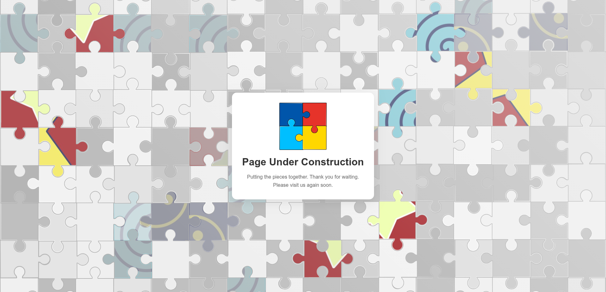

# Spectrum Build Page



A professional "Under Construction" page featuring a dynamic neurodiversity theme. This project utilizes a puzzle-based SVG visual with randomized animations to symbolize the page building process and the identity spectrum.

👉 **[Live Demo on GitHub Pages](https://dognew.github.io/spectrum-build-page/)**

## Tech Stack
* **HTML5**
* **CSS3**
* **JavaScript (Vanilla)**
* **SVG**

## Features
* **Dynamic Animations:** Randomized puzzle piece assembly using JavaScript.
* **Responsive Design:** Optimized SVG layouts for both Desktop and Mobile devices.
* **Clean Layout:** Modern interface designed to maintain brand presence during development.

## Hybrid Environment Support (Docker vs. GitHub Pages)

This project is designed to be environment-aware, allowing it to run seamlessly on both full-stack servers and static hosting platforms:

* **Server/Docker Environment:** The system automatically uses the PHP API (`api/spectrumbp-get-images.php`) to dynamically scan the image directory and return the file list. No manual intervention is required when adding new assets.
* **Static Environment (GitHub Pages):** Since GitHub Pages does not support server-side PHP, the JavaScript engine detects the `github.io` hostname and switches to a static JSON fallback (`api/spectrumbp-files.json`).
* **Manual Update Requirement:** When deploying to a static environment, any new images added to `assets/img/spectrumbp/` must be manually registered in the `api/spectrumbp-files.json` file to be recognized by the animation engine.

## JavaScript Logic & Animations

The core of this project is a procedural animation engine built with Vanilla JS. It manages the SVG lifecycle and dynamic styling:

* **Asset Management:** Uses asynchronous fetching to retrieve image files and dynamically injects them as SVG patterns, ensuring precise pixel mapping based on real-time DOM measurements.
* **Intelligent Patterns:** Includes a rotation-neutralization algorithm that calculates the transformation matrix of SVG paths to keep background images upright regardless of the piece's orientation.
* **Randomization Engine:** * **Fade-In:** Simulates the "assembly" of the puzzle.
    * **Color Pulse:** Cycles pieces through a neurodiversity-inspired color palette.
    * **Photo Spectrum:** Randomly populates pieces with high-definition imagery.
* **Performance & Cache:** Implements session-based cache busting to ensure asset integrity without sacrificing performance during state changes.

## CSS Animations & Styling

The visual identity of the project is driven by a custom CSS animation engine designed to create a non-linear, organic feel:

* **Organic Pulsing:** Uses `@keyframes` to create smooth color and opacity transitions, symbolizing the "vibrancy" of the spectrum.
* **Dynamic Variations:** Includes multiple animation classes (`.pulse-slow`, `.pulse-medium`, `.pulse-fast`) that allow the JavaScript engine to assign different rhythms to each puzzle piece, avoiding synchronized, robotic movements.
* **Spectrum Palette:** Custom color classes tailored to the neurodiversity theme (Blue, Red, Yellow, Cyan), integrated with CSS variables for consistency.
* **Responsive Layout:** A mobile-first approach using `z-index` layering to ensure the interactive puzzle background never interferes with the readability of the main content.

## Project Structure
```
spectrum-build-page/
├── api/
│   └── spectrumbp-get-images.php
├── assets/
│   ├── css/
│   │   └── style.css
│   ├── img/
│   │   ├── favicon.png
│   │   ├── logo.png
│   │   └── spectrumbp/
│   │       ├── spectrumbp-1.jpg
│   │       ├── ...
│   │       └── thumbnail-spectrumbp.png
│   ├── js/
│   │   └── main.js
│   └── svg/
│       ├── puzzle-desktop.svg
│       └── puzzle-mobile.svg
├── docker-compose.yml
├── Dockerfile
├── index.html
├── LICENSE
└── README.md
```

* `/assets/svg/`: Contains the puzzle vector files.
* `/assets/js/`: Logic for piece randomization and animations.
* `/assets/css/`: Styling and layout positioning.

### How to Use & Customize

To customize this "Under Construction" page for your own brand, follow these steps:

1. **Brand Assets:**
* Replace `assets/img/favicon.png` with your own favicon.
* Replace `assets/img/logo.png` with your company or project logo.


2. **Spectrum Images:**
* Navigate to `assets/img/spectrumbp/`.
* Delete the default `spectrumbp-N.jpg` files.
* Add your new images following the naming convention: `spectrumbp-1.jpg`, `spectrumbp-2.jpg`, etc.
* **Note:** If you use a different naming pattern, you must update the logic in `assets/js/main.js` to ensure the internal API and pattern injector can resolve the file paths correctly.

3. SVG Customization

To customize the puzzle vectors, you can open and edit the `puzzle-desktop.svg` and `puzzle-mobile.svg` files using [Inkscape](https://www.google.com/search?q=https://inkscape.org/) or any SVG editor of your choice.

* **Maintain Structure**: Ensure that the puzzle pieces remain as individual `<path>` elements so the JavaScript engine can correctly identify and animate them.
* **Optimization**: After editing, it is recommended to save the file as an "Optimized SVG" to remove unnecessary metadata and keep the file size minimal for better web performance.

4. **Deployment:**
* This project is containerized. You can run it locally or deploy it using the provided `docker-compose.yml` and `Dockerfile`.

## License
This project is open source and available under the [MIT License](LICENSE).